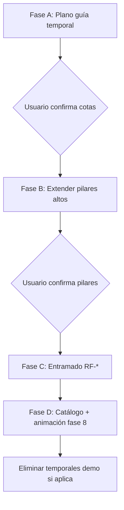

# Plan de modelado — Cubierta con plano guía

Documento de trabajo para **revisar y confirmar** antes de generar geometría en `tinker.obj`.

Estado: **borrador para aprobación**  
Última actualización: 2025-06-03

---

## 1. Objetivo

Modelar el **entramado de cubierta** (fase 8, categoría `roof`) con:

- **Pendiente** definida entre la cumbrera baja (PIL-024) y la alta (PIL-021).
- **Voladizos** en la dirección de la pendiente (eje X).
- **Plano guía temporal** (`PlaneGuide`) visible en el visor para validar cotas antes de fijar vigas y pilares.
- Geometría generada por código (`model/geom/`) con historial (`EditSession`).

El intento anterior (41 piezas RF-001…041) se eliminó por geometría incorrecta. Este plan prioriza **validar el plano primero**, luego pilares, luego entramado.

---

## 2. Convenciones

| Concepto | Valor |
|----------|-------|
| Eje vertical | **Z** (Tinkercad) |
| Escala | **1 u. modelo = 0.1 m real** (10 cm) |
| Referencia altura pilar | PIL-002: 73 u → 7.3 m |
| Tope forjado P2 (V2-010) | Z = **45.0 u** (4.5 m real) |
| Separación V1-013 → V2-010 | 25 u libres entre caras (2.5 m) |

Helpers: `meters_to_model()` / `model_to_meters()` en `tools/build_catalog.py`.

---

## 3. Criterios geométricos acordados

### 3.1 Pendiente

Medida **desde el tope de V2-010** (Z = 45), no desde el tope actual del pilar (Z = 73):

| Punto de referencia | X (planta) | Altura sobre V2-010 | Cota Z entramado |
|---------------------|------------|---------------------|------------------|
| **Baja — PIL-024** | 98 | **+3.0 m** → +30 u | **75.0 u** (7.5 m) |
| **Alta — PIL-021** | 25 | **+4.5 m** → +45 u | **90.0 u** (9.0 m) |

Ambos pilares están en la fila **Y = −100** (fachada sur del modelo).

### 3.2 Función de cota en X

Pendiente lineal entre las columnas de PIL-021 y PIL-024 (ignorando voladizo en esta fórmula base):

```
z_roof(x) = 75 + 15 × (98 − x) / 73
```

| X columna | z_roof | Extensión sobre pilar alto (73 u) |
|-----------|--------|-----------------------------------|
| 98 (PIL-024) | 75.0 | +2.0 u (+0.2 m) |
| 77 | 79.3 | +6.3 u |
| 60 | 82.8 | +9.8 u |
| 25 (PIL-021) | 90.0 | +17.0 u |
| 0 | 95.1* | +22.1 u* |

\*Extrapolación fuera del vano entre PIL-021 y PIL-024; no aplica a pilares cortos en X=0 (ver §5).

**Pendiente:** 15 u / 73 u ≈ **20.5 %** (~11.6°).

### 3.3 Voladizo

- **1.0 m real** = **10 u** modelo.
- Dirección: **eje X**, misma orientación que la pendiente (de PIL-024 hacia PIL-021).
- Propuesta inicial (voladizo en **ambos** extremos del plano):

| Borde | X límite | z en ese X |
|-------|----------|------------|
| Voladizo bajo (más allá de PIL-024) | **108** | ≈ 73.0 u |
| Voladizo alto (más allá de PIL-021) | **15** | ≈ 92.1 u |

### 3.4 Planta del plano

| Eje | Propuesta | Notas |
|-----|-----------|-------|
| **X** | 15 … 108 | Incluye voladizos |
| **Y** | 0 … −100 | Alineado con la malla de pilares y forjado P2 (Y = 0, −25, −50, −75, −100) |

Forjado P2 en planta: X ≈ 10…99, Y ≈ −101…1.

---

## 4. Plano guía (`PlaneGuide`)

### 4.1 Rol

Cuadrilátero **coplanar** que materializa la superficie de referencia del entramado:

- Pieza temporal `TMP-RPL` (o similar), categoría `__temp__`, nota `demo:roof-plane`.
- Visible en el visor con estilo cyan (igual que otros temporales).
- **No** es sólido estructural; no entra en fase 8 de animación.

### 4.2 Vértices propuestos

Orden CCW visto desde arriba (+Z):

```
P0 = (15,    0, z(15))     ≈ (15,   0, 92.05)
P1 = (108,   0, z(108))    ≈ (108,  0, 72.95)
P2 = (108, -100, z(108))   ≈ (108,-100, 72.95)
P3 = (15,  -100, z(15))    ≈ (15,-100, 92.05)
```

Donde `z(x) = 75 + 15×(98−x)/73`.

### 4.3 Validación visual

Antes de cualquier viga o extensión de pilar:

1. Regenerar demo / script de plano.
2. En el visor (modo modelado): comprobar que el plano **pasa por** las cotas PIL-021 (Z≈90) y PIL-024 (Z≈75) en Y=−100.
3. Comprobar voladizos sobresaliendo ~1 m en X.
4. Opcional: líneas temporales en los ejes de pilares hasta intersección con el plano.

---

## 5. Extensión de pilares

Solo pilares **altos** (tope actual Z = 73). Excluidos:

| ID | Motivo |
|----|--------|
| PIL-001, 006, 011, 015, 020 | Pilares cortos (tope Z ≈ 14) |
| PIL-025 | Corto (tope Z ≈ 17.5), columna X=98 pero no fila estándar |

Para cada pilar alto, **extender en +Z** hasta `z_roof(x)` con `extend_volume_to()` (`model/geom/extend.py`):

| Columna X | Pilares | z objetivo |
|-----------|---------|------------|
| 25 | PIL-002, 007, 012, 016, **021** | 90.0 |
| 60 | PIL-003, 008, 013, 017, 022 | 82.8 |
| 77 | PIL-004, 009, 014, 018, 023 | 79.3 |
| 98 | PIL-005, 010, 019, **024** | 75.0 |

**Nota:** PIL-021 y PIL-024 son las referencias de pendiente; el resto sigue la misma ley en X.

Flujo:

1. Snapshot de historial (`EditSession`, mensaje descriptivo).
2. Por cada pilar: `volume_from_part` → `extend_volume_to(..., z=z_roof(x))` → reemplazar `obj_*` en OBJ.
3. `build_catalog.py` → actualizar bounds.
4. Validar en visor: tope de pilar ≈ intersección con plano guía.

---

## 6. Entramado (fase 8)

### 6.1 Enfoque

Tras aprobar el plano y los pilares:

1. **Vigas principales de cubierta** — paralelas a **Y**, apoyadas en columnas X = 25, 60, 77, 98 (y extremos del voladizo si aplica).
2. **Correas / vigas secundarias** — paralelas a **X**, siguiendo la pendiente (cajas orientadas o `Solid` con vértices calculados sobre el plano).
3. Cada viga: prisma con sección constante; eje longitudinal sobre el plano; longitud entre apoyos.

### 6.2 Sección propuesta (heredada del intento anterior)

| Parámetro | Valor inicial | Real |
|-----------|---------------|------|
| Ancho (perpendicular al eje) | 1.0 u | 0.10 m |
| Canto (normal al plano) | ~2.5 u | 0.25 m |
| Material | `color_7035299` (gris cubierta) | — |

Ajustable tras ver el plano en el visor.

### 6.3 IDs y catálogo

- Prefijo **`RF-###`** (roof framing).
- Categoría **`roof`**, fase **8**.
- Reactivar fase 8 en `catalog/categories.json` (animación `fall`).

### 6.4 Generación

Script nuevo: `model/build_roof_framing.py` (o módulo `model/roof/`):

```
roof_plane()           → PlaneGuide (temporal)
pillar_target_z(x)     → float
extend_pillars()       → muta OBJ existente
generate_framing()     → lista de Solid → append_objects
```

Usar `union_volumes` solo cuando una pieza lógica sea compuesta; preferir **un obj por viga** (como Tinkercad).

---

## 7. Fases de ejecución



| Fase | Entregable | Bloqueante |
|------|------------|------------|
| **A** | `TMP-RPL` plano inclinado | Confirmación visual |
| **B** | 20 pilares extendidos | Confirmación visual |
| **C** | RF-001…N vigas | Confirmación visual |
| **D** | `parts.json`, fase 8, historial | — |

---

## 8. Validación y criterios de aceptación

- [ ] Plano pasa por Z=90 en (25, −100) y Z=75 en (98, −100).
- [ ] Voladizos ≈ 1 m en X (15 y 108).
- [ ] Ningún índice de cara inválido en OBJ (`validate` post-edición).
- [ ] Todos los sólidos cerrados (`ensure_closed_solids`).
- [ ] Cotas pilares = `z_roof(x)` ± 0.1 u.
- [ ] Vigas apoyadas en pilares sin huecos > 0.5 u en extremos.
- [ ] Animación fase 8 reproduce sin errores.

---

## 9. Lecciones del intento anterior

- No generar 41 vigas sin validar primero el plano de referencia.
- Evitar AABB de vigas inclinadas (cajas axis-aligned deformaban la pendiente).
- Usar **`Solid` + vértices sobre el plano** o prisma orientado, no `Volume.from_aabb` para piezas inclinadas.
- Siempre snapshot de historial antes de mutar pilares (irreversible sin rollback).

---

## 10. Decisiones a confirmar

Marca o corrige antes de que procedamos:

1. **Voladizo:** ¿ambos extremos (X=15 y X=108) o solo en PIL-024 (+X)?
2. **Planta Y:** ¿0…−100 exacto o incluir margen/voladizo en Y?
3. **Pilares x=0:** ¿confirmado que no se extienden (quedan bajo forjado P1)?
4. **Sección de viga:** ¿1.0 × 2.5 u está bien o prefieres otra?
5. **Orden de ejecución:** ¿empezamos solo con **Fase A** (plano temporal) tras tu OK?

---

## 11. Comandos previstos

```bash
# Fase A — plano guía (tras implementar script)
uv run python model/build_roof_plane.py

# Fase B — extender pilares
uv run python model/extend_pillars_to_roof.py

# Fase C — entramado
uv run python model/build_roof_framing.py

# Rebuild catálogo
uv run python tools/build_catalog.py
```

---

## Referencias en el repo

- Plano: `model/geom/plane.py` (`PlaneGuide`)
- Extensión: `model/geom/extend.py`
- Booleanos: `model/geom/boolean.py` (trimesh + manifold3d)
- Historial: `model/session.py`
- Snapshot previo con RF-* (referencia): `history/snapshots/0008-despu-s-entramado-cubierta-con-pendiente/`
