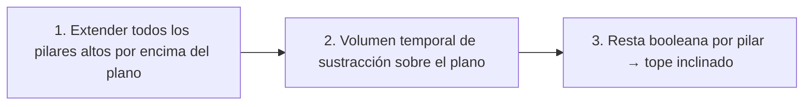
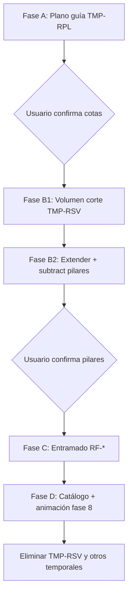

# Plan de modelado — Cubierta con plano guía

Documento de trabajo para **revisar y confirmar** antes de generar geometría en `tinker.obj`.

Estado: **Fase C completada** — entramado RF-001…041, fase 8 activa  
Última actualización: 2025-06-07

---

## 1. Objetivo

Modelar el **entramado de cubierta** (fase 8, categoría `roof`) con:

- **Pendiente** definida entre la cumbrera baja (PIL-024) y la alta (PIL-021).
- **Voladizos** en la dirección de la pendiente (eje X).
- **Plano guía temporal** (`PlaneGuide`) visible en el visor para validar cotas antes de fijar vigas y pilares.
- Geometría generada por código (`model/geom/`) con historial (`EditSession`).

El intento anterior (41 piezas RF-001…041) se eliminó por geometría incorrecta. Este plan prioriza **validar el plano primero**, luego pilares, luego entramado.

---

## 2. Convenciones

| Concepto | Valor |
|----------|-------|
| Eje vertical | **Z** (Tinkercad) |
| Escala | **1 u. modelo = 0.1 m real** (10 cm) |
| Referencia altura pilar | PIL-002: 73 u → 7.3 m |
| Tope forjado P2 (V2-010) | Z = **45.0 u** (4.5 m real) |
| Separación V1-013 → V2-010 | 25 u libres entre caras (2.5 m) |

Helpers: `meters_to_model()` / `model_to_meters()` en `tools/build_catalog.py`.

---

## 3. Criterios geométricos acordados

### 3.1 Pendiente

Medida **desde el tope de V2-010** (Z = 45), no desde el tope actual del pilar (Z = 73):

| Punto de referencia | X (planta) | Altura sobre V2-010 | Cota Z entramado |
|---------------------|------------|---------------------|------------------|
| **Baja — PIL-024** | 98 | **+2.5 m** → +25 u | **70.0 u** (7.0 m) |
| **Alta — PIL-021** | 25 | **+4.0 m** → +40 u | **85.0 u** (8.5 m) |

Ambos pilares están en la fila **Y = −100** (fachada sur del modelo).

### 3.2 Función de cota en X

Pendiente lineal entre las columnas de PIL-021 y PIL-024 (ignorando voladizo en esta fórmula base):

```
z_roof(x) = 70 + 15 × (98 − x) / 73
```

| X columna | z_roof | Nota (tope pilar actual = 73 u) |
|-----------|--------|-----------------------------------|
| 98 (PIL-024) | 70.0 | Material por encima del plano antes del corte |
| 77 | 74.3 | Idem |
| 60 | 77.8 | Idem |
| 25 (PIL-021) | 85.0 | Idem |
| 0 | 90.1* | Extrapolación; pilares cortos en X=0 no participan |

\*Extrapolación fuera del vano entre PIL-021 y PIL-024; no aplica a pilares cortos en X=0 (ver §5).

**Pendiente:** 15 u / 73 u ≈ **20.5 %** (~11.6°).

### 3.3 Voladizo

- **2.0 m real** = **20 u** modelo.
- Dirección: **eje X**, misma orientación que la pendiente (de PIL-024 hacia PIL-021).
- Voladizo en **ambos** extremos del plano:

| Borde | X límite | z en ese X |
|-------|----------|------------|
| Voladizo bajo (más allá de PIL-024) | **118** | ≈ 65.9 u |
| Voladizo alto (más allá de PIL-021) | **5** | ≈ 89.1 u |

### 3.4 Planta del plano

| Eje | Propuesta | Notas |
|-----|-----------|-------|
| **X** | 5 … 118 | Incluye voladizos (2 m) |
| **Y** | **1 … −101** | Borde exterior pilares / forjado P2 (centros en 0 … −100) |

Forjado P2 en planta: X ≈ 10…99, Y ≈ −101…1.

---

## 4. Plano guía (`PlaneGuide`)

### 4.1 Rol

Cuadrilátero **coplanar** que materializa la superficie de referencia del entramado:

- Pieza temporal `TMP-RPL` (o similar), categoría `__temp__`, nota `demo:roof-plane`.
- Visible en el visor con estilo cyan (igual que otros temporales).
- **No** es sólido estructural; no entra en fase 8 de animación.

### 4.2 Vértices propuestos

Orden CCW visto desde arriba (+Z):

```
P0 = (5,     1, z(5))      ≈ (5,    1, 89.11)
P1 = (118,   1, z(118))    ≈ (118,  1, 65.89)
P2 = (118, -101, z(118))   ≈ (118,-101, 65.89)
P3 = (5,   -101, z(5))     ≈ (5, -101, 89.11)
```

Donde `z(x) = 70 + 15×(98−x)/73`.

### 4.3 Validación visual

Antes de cualquier viga o extensión de pilar:

1. Regenerar demo / script de plano.
2. En el visor (modo modelado): comprobar que el plano **pasa por** las cotas PIL-021 (Z≈85) y PIL-024 (Z≈70) en Y=−100.
3. Comprobar voladizos sobresaliendo ~2 m en X.
4. Opcional: líneas temporales en los ejes de pilares hasta intersección con el plano.

---

## 5. Pilares con tope en pendiente (extensión + sustracción)

Los pilares son prismas **alineados a ejes** (extrusión vertical). Para que el **tope siga la pendiente** del plano de cubierta no basta con alargarlos hasta `z_roof(x)` por columna: hace falta **cortar** el material que queda por encima del plano inclinado.

### 5.1 Estrategia (3 pasos)



| Paso | Acción | Resultado |
|------|--------|-----------|
| **1** | Extender en **+Z** todos los pilares altos hasta una cota **única** por encima del plano | Prisma vertical que atraviesa el plano |
| **2** | Generar **`TMP-RSV`** — volumen temporal del semiespacio **por encima** del plano de cubierta | Pieza de corte visible en el visor |
| **3** | `subtract_volumes(pilar_extendido, TMP-RSV)` por cada pilar | Tope del pilar = intersección pilar ∩ plano (pendiente correcta) |

### 5.2 Pilares incluidos

Solo pilares **altos** (tope actual Z = 73). Excluidos:

| ID | Motivo |
|----|--------|
| PIL-001, 006, 011, 015, 020 | Pilares cortos (tope Z ≈ 14) |
| PIL-025 | Corto (tope Z ≈ 17.5) |

**19 pilares** en columnas X = 25, 60, 77, 98 (filas Y = 0, −25, −50, −75, −100). En X = 98, Y = −50 es **PIL-025** (corto) — no hay pilar alto en esa celda.

Incluso en X = 98, donde el tope actual (73) ya supera `z_roof` (70), el pilar se **extiende igual** y luego la sustracción deja el tope en la cota del plano.

### 5.3 Cota de extensión (+Z)

Una sola cota para todos, **por encima del punto más alto del plano**:

```
z_extend = max(z en vértices TMP-RPL) + margen
         ≈ 89.1 + 5  →  95 u   (margen 0.5 m real)
```

Implementación: `extend_volume_to(volume, z=z_extend)` (`model/geom/extend.py`).

### 5.4 Volumen temporal de sustracción (`TMP-RSV`)

Prisma de **8 vértices** (no axis-aligned): cara inferior = cuadrilátero del plano de cubierta; cara superior = mismo contorno en XY elevado a `z_cut_top` (p. ej. **120 u**, holgura sobre `z_extend`).

| Propiedad | Valor |
|-----------|-------|
| ID | `TMP-RSV` |
| Nota | `demo:roof-subtract` |
| Categoría | `__temp__` |
| Base inferior | Mismos vértices que `TMP-RPL` (X 5…118, Y 1…−101, Z según pendiente) |
| Tope superior | Misma planta XY, Z = `z_cut_top` |

Representa **todo el material por encima del plano** dentro del rectángulo de cubierta. Al restarlo de un pilar extendido, desaparece el “sombrero” vertical y queda la **superficie de corte inclinada**.

Estilo en visor: semitransparente (p. ej. rojo/naranja) para validar antes de aplicar el corte a producción.

### 5.5 Corte por pilar

Por cada pilar alto:

1. `vol = volume_from_part(pilar)`
2. `extended = extend_volume_to(vol, z=z_extend)` → `Solid`
3. `cut = subtract_volumes(extended, above_plane_solid)[0]`
4. Reemplazar `obj_*` del pilar en `tinker.obj`
5. Validar malla cerrada (`ensure_closed_solids`)

Motor: `model/geom/boolean.py` (trimesh + **manifold3d**).

### 5.6 Temporales tras Fase B

| Pieza | Tras validación |
|-------|-----------------|
| `TMP-RPL` | Mantener hasta terminar entramado (referencia) |
| `TMP-RSV` | Eliminar del OBJ una vez confirmados los pilares (solo herramienta de corte) |

### 5.7 Flujo operativo

1. Snapshot (`EditSession`, mensaje descriptivo).
2. Generar / refrescar `TMP-RSV` en el OBJ (visible en visor).
3. Extender + restar los 20 pilares.
4. `build_catalog.py` → actualizar bounds.
5. Validar en visor: tope de cada pilar coincide con `TMP-RPL` ± tolerancia.
6. Eliminar `TMP-RSV` si ya no hace falta visualizar el volumen de corte.


---

## 6. Entramado (fase 8)

### 6.1 Enfoque

Tras aprobar el plano y los pilares:

1. **Vigas principales de cubierta** — paralelas a **Y**, apoyadas en columnas X = 25, 60, 77, 98 (y extremos del voladizo si aplica).
2. **Correas / vigas secundarias** — paralelas a **X**, siguiendo la pendiente (cajas orientadas o `Solid` con vértices calculados sobre el plano).
3. Cada viga: prisma con sección constante; eje longitudinal sobre el plano; longitud entre apoyos.

### 6.2 Sección propuesta (heredada del intento anterior)

| Parámetro | Valor inicial | Real |
|-----------|---------------|------|
| Ancho (perpendicular al eje) | 1.0 u | 0.10 m |
| Canto (normal al plano) | ~2.5 u | 0.25 m |
| Material | `color_7035299` (gris cubierta) | — |

Ajustable tras ver el plano en el visor.

### 6.3 IDs y catálogo

- Prefijo **`RF-###`** (roof framing).
- Categoría **`roof`**, fase **8**.
- Reactivar fase 8 en `catalog/categories.json` (animación `fall`).

### 6.4 Generación

Script nuevo: `model/build_roof_framing.py` (o módulo `model/roof/`):

```
roof_plane()              → PlaneGuide (TMP-RPL)
roof_above_volume()       → Solid prisma sobre el plano (TMP-RSV)
pillar_extend_z()         → float (cota común de extensión)
slope_pillars_to_roof()   → extiende + subtract por pilar
generate_framing()        → lista de Solid → append_objects
```

Usar `union_volumes` solo cuando una pieza lógica sea compuesta; preferir **un obj por viga** (como Tinkercad).

---

## 7. Fases de ejecución



| Fase | Entregable | Bloqueante |
|------|------------|------------|
| **A** | `TMP-RPL` plano inclinado | Confirmación visual ✅ |
| **B1** | `TMP-RSV` volumen de sustracción | Confirmación visual |
| **B2** | 19 pilares con tope en pendiente | Confirmación visual |
| **C** | RF-001…N vigas | Confirmación visual |
| **D** | `parts.json`, fase 8, historial | — |

---

## 8. Validación y criterios de aceptación

- [ ] Plano pasa por Z=85 en (25, −100) y Z=70 en (98, −100).
- [ ] Voladizos ≈ 2 m en X (5 y 118); planta Y = 1 … −101 (borde de pilares).
- [ ] Ningún índice de cara inválido en OBJ (`validate` post-edición).
- [ ] Todos los sólidos cerrados (`ensure_closed_solids`).
- [ ] Tope de cada pilar alto coincide con `TMP-RPL` ± 0.1 u en su centro X.
- [ ] No queda material del pilar por encima del plano (corte limpio).
- [ ] Vigas apoyadas en pilares sin huecos > 0.5 u en extremos.
- [ ] Animación fase 8 reproduce sin errores.

---

## 9. Lecciones del intento anterior

- No generar 41 vigas sin validar primero el plano de referencia.
- Evitar AABB de vigas inclinadas (cajas axis-aligned deformaban la pendiente).
- Usar **`Solid` + vértices sobre el plano** o prisma orientado, no `Volume.from_aabb` para piezas inclinadas.
- Siempre snapshot de historial antes de mutar pilares (irreversible sin rollback).
- Probar **un pilar** (p. ej. PIL-013) antes de batch de 20.
- El volumen `TMP-RSV` debe ser watertight; si falla el booleano, revisar margen `z_cut_top`.

---

## 10. Decisiones a confirmar

Marca o corrige antes de que procedamos:

1. **Voladizo:** confirmado en ambos extremos (X=5 y X=118), **2 m** cada uno.
2. **Planta Y:** confirmado borde exterior pilares (**1 … −101**).
3. **Pilares x=0:** no se modifican (cortos, bajo forjado P1).
4. **Tope pilares:** extensión común + sustracción con `TMP-RSV` (§5).
5. **Sección de viga:** ¿1.0 × 2.5 u está bien o prefieres otra?
6. **Siguiente paso:** ¿Fase B1 (`TMP-RSV`) + prueba en un pilar?

---

## 11. Comandos previstos

```bash
# Fase A — plano guía
uv run python model/build_roof_plane.py

# Fase B1 — volumen temporal de sustracción
uv run python model/build_roof_subtract_volume.py

# Fase B2 — pilares: extender + cortar a pendiente
uv run python model/slope_pillars_to_roof.py
# opcional: --pilot PIL-013  (un solo pilar de prueba)

# Fase C — entramado
uv run python model/build_roof_framing.py

# Rebuild catálogo
uv run python tools/build_catalog.py
```

---

## Referencias en el repo

- Plano: `model/geom/plane.py` (`PlaneGuide`)
- Extensión: `model/geom/extend.py`
- Booleanos: `model/geom/boolean.py` (trimesh + manifold3d)
- Historial: `model/session.py`
- Snapshot previo con RF-* (referencia): `history/snapshots/0008-despu-s-entramado-cubierta-con-pendiente/`
