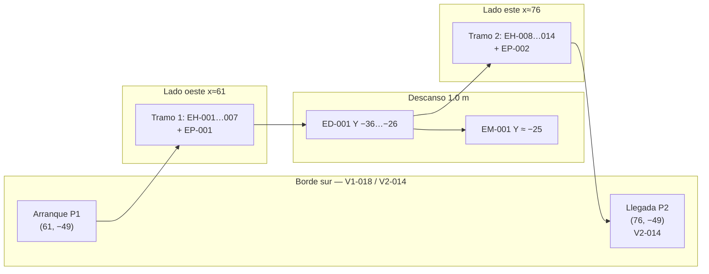
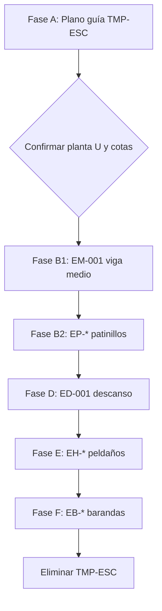

# Plan de modelado — Escalera en U

Documento de trabajo para **revisar y confirmar** antes de generar geometría en `tinker.obj`.

Estado: **Escalera en modelo con animación fases 9–12** — pendiente barandas (F revertida)  
Última actualización: 2026-06-07

---

## 1. Objetivo

Modelar la **escalera en U** en el hueco estructural delimitado por **PIL-008, PIL-009, PIL-013 y PIL-014**, usando como referencia de forjado los tramos **V1-018 → V2-014** (borde sur del hueco) y el par norte **V1-007 → V2-006** (borde norte).

Elementos a implementar (en este orden):

1. **Viga de medio** entre pilares 8 y 9 (descanso estructural).
2. **Soportes** (patinillos / stringers): tramo **oblicuo + recto** en cada mitad (V1→medio, medio→V2).
3. **Descanso** (forjado de giro) **atado** a la viga de medio.
4. **Peldaños** (huellas) perpendiculares al recorrido, sobre tramos oblicuos.
5. **Barandas** perimetrales del hueco y del descanso.

Geometría generada por código (`model/geom/`), historial con `EditSession`, validación en el visor antes de fijar detalles finos.

---

## 2. Convenciones (heredadas del modelo)

| Concepto | Valor |
|----------|-------|
| Eje vertical | **Z** |
| Escala | **1 u. modelo = 0.1 m real** (10 cm) |
| Tope forjado P1 (referencia huella) | **Z = 17.5 u** (cara superior vigas V1-*) |
| Tope forjado P2 (referencia huella) | **Z = 45.0 u** (cara superior vigas V2-*) |
| Altura entre forjados | **ΔZ = 27.5 u** (2.75 m) |
| Sección vigas forjado existentes | 1.0 × 2.5 u (ancho × canto) |

---

## 3. Envelope del hueco (planta)

Cuadrilátero interior **entre caras interiores** de los cuatro pilares:

| Esquina | Pilar | Centro (X, Y) | Cara interior aprox. |
|---------|-------|---------------|----------------------|
| NO | PIL-008 | (60, −25) | X = **61**, Y = **−26** |
| NE | PIL-009 | (77, −25) | X = **76**, Y = **−26** |
| SO | PIL-013 | (60, −50) | X = **61**, Y = **−49** |
| SE | PIL-014 | (77, −50) | X = **76**, Y = **−49** |

**Vanos libres**

| Eje | Rango interior | Real |
|-----|----------------|------|
| **X** | 61.0 … 76.0 | 1.50 m |
| **Y** | −49.0 … −26.0 | 2.30 m |

**Vigas de borde del hueco** (misma luz X = 61…76):

| Nivel | Sur (Y ≈ −50) | Norte (Y ≈ −25) |
|-------|---------------|-----------------|
| P1 | **V1-018** (Z 15…17.5) | **V1-007** (Z 15…17.5) |
| P2 | **V2-014** (Z 42.5…45) | **V2-006** (Z 42.5…45) |

El usuario indicó explícitamente el par sur **V1-018 / V2-014** para arranque y **llegada a P2**; el norte (**V1-007 / V2-006**) delimita el hueco y aloja la **viga de medio** (EM-001).

---

## 4. Métricas de comodidad (confirmadas)

Criterios de referencia (habitacional, orden de magnitud CTE / uso residencial):

| Parámetro | Objetivo | Rango aceptable |
|-----------|----------|-----------------|
| Contrahuella **R** | 17–18 cm | 17–20 cm |
| Huella **T** (a lo largo del recorrido) | 28–30 cm | ≥ 25 cm |
| Fórmula de **Blondel** 2R + T | 63–65 cm | 61–66 cm |
| Profundidad **descanso** | 1.0 m | ≥ 1.0 m |

**Altura total:** ΔZ = **27.5 u** (2.75 m), repartida en **dos tramos iguales** con descanso intermedio.

### 4.1 Reparto vertical

| Magnitud | Valor |
|----------|-------|
| Contrahuellas por tramo | **7** |
| Contrahuellas totales (sin contar rellano) | **14** |
| **R** = 13.75 / 7 | **1.964 u** → **19.6 cm** (límite alto, aceptable) |
| Cota descanso (huella superior) | **31.25 u** (= 17.5 + 7×1.964) |

### 4.2 Reparto en planta (U, llegada sur)

| Tramo | Lado | Recorrido horizontal (Y) | Huellas | T horizontal | T a lo largo del paso* |
|-------|------|--------------------------|---------|--------------|------------------------|
| 1 — V1 → descanso | Oeste (x≈61) | 13 u (−49 → −36) | 6 + giro | 2.17 u | **≈ 2.65 u** (26 cm) |
| **Descanso** | Norte pegado a EM | **10 u** (−36 → −26) | — | — | 1.0 m real |
| 2 — descanso → V2-014 | Este (x≈76) | 13 u (−36 → −49) | 6 + llegada | 2.17 u | **≈ 2.65 u** (26 cm) |

\*T a lo largo del paso = hipotenusa del triángulo (T_h, R) por huella; es la que cumple Blondel caminando:

- Tramo 1: 2×19.6 + 25.1 ≈ **64.3 cm** ✓  
- Tramo 2: 2×19.6 + 26.5 ≈ **65.7 cm** ✓

El patinillo modela **oblicuo** (subida/bajada) + **recto** (tramo horizontal a cota de descanso o de llegada) para absorber el giro sin forzar una huella oblicua en planta. Las **superficies de apoyo** (peldaños y rellano) se modelan aparte — ver §7.4 y Fase E.

### 4.3 Descanso (ED-001)

| Parámetro | Valor |
|-----------|-------|
| Profundidad (eje Y) | **10 u** (1.0 m) — **−36 … −26** |
| Luz (eje X) | **15 u** (61 … 76) |
| Cota huella superior (EH-008 / rellano) | **31.25 + R** u ≈ **33.21 u** |
| Canto ED-001 | **0.25 u** (igual que peldaños) |
| Apoyo norte | Borde **Y = −26** pegado a **EM-001** (Y = −25) |

---

## 5. Concepto en U (planta)

Recorrido confirmado (visto desde arriba, +Z):



- **Tramo 1:** arranque en **V1-018** (sur-oeste); patinillo **EP-001** + peldaños **EH-001…007** en el oblicuo; tramo **recto** del patinillo a **Y = −26** (sin peldaños sueltos).
- **Descanso:** rellano **ED-001** (**Y −36 … −26**), borde norte en contacto con **EM-001**; aquí se completa el giro en planta.
- **Tramo 2:** patinillo **EP-002** + peldaños **EH-008…014** en el oblicuo desde **borde sur** del descanso (**76, −36**, Z superior 33.75) hacia **V2-014**.

---

## 6. Cotas verticales (referencia)

| Referencia | Z (cara superior) | Nota |
|----------|-------------------|------|
| Forjado P1 | **17.5** | Huella / arranque (V1-018) |
| **Descanso** | **31.25** | Tras 7 contrahuellas |
| Forjado P2 | **45.0** | Huella superior (**V2-014**) |
| Δ por tramo | **13.75 u** | 7 × 1.964 u |

**Huellas tramo 1** (Z cara superior, k = 1…7):

| k | Z (u) | Y aprox. (u) |
|---|-------|--------------|
| 1 | 19.46 | −47.4 |
| 2 | 21.43 | −45.9 |
| 3 | 23.39 | −44.3 |
| 4 | 25.36 | −42.7 |
| 5 | 27.32 | −41.1 |
| 6 | 29.28 | −39.6 |
| 7 | **31.25** | **−36.0** |

**Huellas tramo 2** (Z cara superior, k = 1…7; oblicuo EP-002 P0→P2):

| k | Z (u) | Y aprox. (u) |
|---|-------|--------------|
| 1 | 33.21 | −37.9 |
| 2 | 35.18 | −39.4 |
| 3 | 37.14 | −41.0 |
| 4 | 39.11 | −42.6 |
| 5 | 41.07 | −44.2 |
| 6 | 43.04 | −45.7 |
| 7 | **45.00** | **−49.0** |

*(Z_k = 31.25 + k×R; Y_k = −36 − k×13/7; R ≈ 1.964 u.)*

**Viga de medio (EM-001)**

- Eje **X**: 61.0 … 76.0 (entre PIL-008 y PIL-009).
- Eje **Y**: **−25.0** (alineada con V1-007 / V2-006).
- Cara inferior: **31.25 u**; canto **2.5 u** → superior **33.75 u**.

---

## 7. Piezas y prefijos

Nueva categoría **`stair`** y **fase 9** en animación (después de cubierta). Colores propuestos: tono madera/acero `#b45309` (revisable).

| Prefijo | Rol | Cant. inicial |
|---------|-----|---------------|
| **EM-###** | Viga de medio (entre PIL-008 y PIL-009) | 1 |
| **EP-###** | Patinillo / soporte (polilínea: oblicuo + recto) | 2 sólidos (EP-001, EP-002) |
| **ED-###** | Descanso (loseta / marco de giro) | 1 |
| **EH-###** | Peldaño / huella (tablón inclinado) | **14** (7 por tramo oblicuo) |
| **EB-###** | Baranda (**postes + travesaño**) | ~6–8 tramos + postes |

### 7.1 EM-001 — Viga de medio

- Prisma 15.0 × 1.0 × 2.5 u (misma sección que vigas V1/V2 del vano).
- Apoyada en el plano de pilares 8 y 9 (cara interior X = 61 y 76).
- El **descanso ED-001** se modela **apoyado / atado** a esta viga (sin hueco > 0.2 u en el contacto).

### 7.2 EP-* — Soportes (oblicuo + recto)

Perfil transversal propuesto (igual que patinillo de cubierta): **1.0 × 1.0 u**.

Cada soporte es una **polilínea 3D extruida** (no solo AABB inclinado):

**EP-001 — patinillo oeste, tramo V1 → descanso**

| Punto | X | Y | Z | Tipo de tramo |
|-------|---|---|---|---------------|
| P0 | 61.0 | −49.0 | 17.5 | Apoyo sur (V1-018) |
| P1 | 61.0 | −36.0 | 33.75 | Fin oblicuo (cara superior del rellano) |
| P2 | 61.0 | −26.0 | 33.75 | Fin recto (borde norte, pegado a EM) |

- **P0→P1:** oblicuo — ΔY = **13 u**, ΔZ = **13.75 u**.
- **P1→P2:** **recto** en Z = 31.25 (10 u hacia EM).

**EP-002 — patinillo este, tramo descanso → V2-014**

| Punto | X | Y | Z | Tipo de tramo |
|-------|---|---|---|---------------|
| P0 | 76.0 | −36.0 | 33.75 | Esquina sur del descanso (bifurcación horiz. / oblicuo) |
| P1 | 76.0 | −26.0 | 33.75 | Fin recto (borde norte, pegado a EM) |
| P2 | 76.0 | −49.0 | 44.99 | Fin oblicuo (7 contrahuellas) |
| P3 | 76.0 | −49.0 | 45.0 | Fin recto (empalme **V2-014**) |

- **P0→P1:** **recto** en Z = 33.75 (10 u hacia EM).
- **P0→P2:** oblicuo desde **borde sur** del descanso — ΔY = **−13 u**, ΔZ = **11.24 u** (no desde P1).
- **P2→P3:** **recto** corto en forjado P2 (alineación con canto de **V2-014**).

Los tramos **rectos** de patinillo (EP-001 P1→P2, EP-002 P0→P1) no llevan peldaños sueltos: la marcha en el rellano la absorbe **ED-001**.

### 7.3 ED-001 — Descanso

- Plataforma **Z = (31.25 + R) − 0.25 … (31.25 + R)** — cara superior alineada con **EH-008**; canto **0.25 u** (igual que peldaños).
- Planta: **X** 61…76, **Y** **−36 … −26** (profundidad **1.0 m**, norte en **Y = −26** pegado a EM-001).
- Recorte booleano opcional contra pilares (solo en ED, no en pilares).
- Superficie de giro entre tramo 1 y tramo 2; **no** sustituye a los peldaños oblicuos.

### 7.4 EH-* — Peldaños (huellas)

Tablones inclinados **perpendiculares al eje de marcha** (normal al patinillo en el tramo oblicuo). El giro en planta lo resuelve el rellano **ED-001**; no se modelan peldaños en los tramos rectos de patinillo.

**Sección propuesta**

| Parámetro | Valor |
|-----------|-------|
| Luz en X (por tramo) | **6.5 u** — mitad del vano interior (13 u) |
| Tramo 1 (oeste) | **X 61 … 68.5** (pegado a EP-001 en X = 61) |
| Tramo 2 (este) | **X 68.5 … 76** (pegado a EP-002 en X = 76) |
| Profundidad (a lo largo del paso) | **≈ 1.86 u** en Y (13/7 u; ≈ 2.65 u a lo largo del oblicuo) |
| Canto (espesor tablón) | **0.25 u** (2.5 cm) — propuesta inicial |
| Cara superior | Cotas **Z_k** de §6 (referencia huella) |
| Material / fase | `color_stair`, categoría `stair`, fase **9** |

**Numeración**

| ID | Tramo | k | Anclaje oblicuo |
|----|-------|---|-----------------|
| **EH-001 … EH-007** | 1 — oeste | 1…7 | EP-001 **P0→P1** |
| **EH-008 … EH-014** | 2 — este | 1…7 | EP-002 **P0→P2** |

**Generación**

- Posición de cada peldaño: interpolar **(Y, Z)** a lo largo del oblicuo en `k / 7` (misma lógica que marcas de contrahuella en `guide.py::_riser_markers_on_oblique`).
- Orientación: eje largo del tablón **⊥** tangente del patinillo; cara superior horizontal en el plano de la huella (normal ≈ dirección de subida).
- **EH-007** comparte borde sur con **ED-001** (Y ≈ −36, Z = 31.25); **EH-008** arranca en la misma esquina sur-este del rellano.
- **EH-014** empalma con forjado **V2-014** (Z = 45.0, Y ≈ −49); el tramo recto EP-002 P2→P3 puede quedar sin peldaño (solo alineación estructural).

Recorte booleano opcional: restar copia temporal de **EP-*** solo del volumen del peldaño en el encuentro lateral (misma estrategia que cubierta).

### 7.5 EB-* — Barandas (postes + travesaño)

Sistema lineal compuesto por **postes verticales** y **travesaño** (pasamanos) continuo por tramo — no un prisma único simplificado.

**Secciones propuestas**

| Elemento | Sección (modelo) | Real aprox. |
|----------|------------------|-------------|
| Poste | **0.2 × 0.2 u** | 2 × 2 cm |
| Travesaño / pasamanos | **0.15 × 0.15 u** (o 0.2 × 0.1 u) | ~1.5–2 cm |

**Alturas**

| Parámetro | Valor |
|-----------|-------|
| Altura poste sobre huella | **1.0 u** (1.0 m) hasta eje del travesaño |
| Separación entre postes | **1.5 … 2.0 u** (15–20 cm) en tramos rectos; **≤ 1.5 u** en curva del descanso |

**Tramos**

| ID | Ubicación |
|----|-----------|
| EB-001 | Borde oeste del hueco (tramo 1), postes siguiendo pendiente |
| EB-002 | Borde este del hueco (tramo 2), postes siguiendo pendiente |
| EB-003 | Frente sur del hueco (entre PIL-013 y PIL-014) |
| EB-004 | Lado sur del descanso (Y ≈ −36) |
| EB-005 | Travesaño / postes del rellano (contorno ED-001) |
| EB-006… | Esquinas, continuidad poste–travesaño |

Cada tramo de baranda = **N postes** (`EBP-*` opcional en código) + **1 travesaño** (`EBT-*`) entre extremos; en el modelo pueden agruparse bajo prefijo **EB-** con notas `post` / `rail`.

Generación: extrusión vertical (postes) + prisma lineal entre cotas de pasamanos (travesaño), anclado a la arista libre del hueco / descanso.

Altura de pasamanos respecto a huella: **1.0 u** (1.0 m) — revisar normativa local si aplica.

---

## 8. Generación en código

Módulo nuevo: `model/stairs/` (propuesta)

```
model/stairs/
  envelope.py      # límites del hueco, puntos de anclaje V1/V2/pilares
  beam.py          # EM-001
  stringer.py      # EP-* — polilínea oblicuo+recto → Solid
  landing.py       # ED-001 — descanso + unión EM-001
  treads.py        # EH-* — peldaños sobre oblicuos
  railing.py       # EB-* — barandas
  catalog_helpers.py
  guide.py         # TMP-ESC (Fase A)
```

Scripts de entrada (por fase):

| Script | Fase | Entregable |
|--------|------|------------|
| `model/build_stairs_guide.py` | A | TMP-ESC |
| `model/build_stairs_mid_beam.py` | B1 | EM-001 |
| `model/build_stairs_stringers.py` | B2 | EP-001, EP-002 |
| `model/build_stairs_landing.py` | D | ED-001 |
| `model/build_stairs_treads.py` | E | EH-001 … EH-014 |
| `model/build_stairs_railings.py` | F | EB-* |
| `model/remove_stairs_guide.py` | — | elimina TMP-ESC |

Helpers reutilizados:

- `Solid`, `Volume`, `_beam_between` (adaptado a polilínea).
- Recorte de empalmes: misma estrategia que cubierta (**restar copia temporal del forjado/pilar solo del patinillo**, no al revés).

---

## 9. Fases de ejecución



| Fase | Entregable | Bloqueante |
|------|------------|------------|
| **A** | `TMP-ESC` — contorno, rellano guía, polilíneas patinillo, marcas contrahuella | Confirmación visual |
| **B1** | EM-001 | Confirmación empalme pilares 8–9 |
| **B2** | EP-001, EP-002 | Confirmación oblicuo/recto y bifurcación EP-002 |
| **D** | ED-001 atado a EM-001 | Confirmación descanso / rellano |
| **E** | EH-001 … EH-014 (7 + 7 peldaños) | Confirmación cotas R, T y empalmes ED / V2-014 |
| **F** | EB-001… | Confirmación barandas |
| **G** | Quitar TMP-ESC; revisión animación fases 9–12 | ✅ TMP-ESC eliminado |

**Animación en visor** (fases 9–12, orden de montaje):

| Fase | Piezas |
|------|--------|
| 9 | EM-001 |
| 10 | EP-001, EP-002 |
| 11 | ED-001 |
| 12 | EH-001 … EH-014 |

---

## 10. Validación y criterios de aceptación

- [ ] Hueco respetado: ninguna pieza invade **X ∉ [61, 76]** o **Y ∉ [−49, −26]** salvo empalmes en V1/V2.
- [x] EM-001 alineada con PIL-008 y PIL-009 en X y con V1-007 / V2-006 en Y.
- [x] Patinillos: segmento **oblicuo** + **recto** en cada tramo (EP-001, EP-002).
- [x] ED-001: profundidad **≥ 1.0 m** (Y −36…−26), borde norte pegado a EM-001.
- [x] EH-*: **14 peldaños** (7 + 7) sobre oblicuos EP-001 P0→P1 y EP-002 P0→P2; cotas §6; sin peldaños en tramos rectos de patinillo.
- [ ] **R ≈ 19.6 cm** constante; Blondel a lo largo del paso **≥ 61 cm** en ambos tramos.
- [ ] Arranque **Z = 17.5** (V1-018); llegada **Z = 45.0** en **V2-014** (sur, x≈76, y≈−49).
- [ ] Barandas continuas en lados libres del hueco.
- [ ] Sólidos cerrados; OBJ sin índices inválidos.
- [x] Animación fases **9–12** (EM → EP → ED → EH) reproduce sin errores.

---

## 11. Decisiones

| Tema | Estado |
|------|--------|
| Llegada P2 por **V2-014** (sur) | ✅ Confirmado |
| Descanso **1.0 m** + métricas de comodidad | ✅ Confirmado (§4) |
| Recorrido U (oeste → descanso → este → sur) | ✅ Confirmado (§5) |
| Sección patinillo **1.0 × 1.0 u** | ✅ EP-001/002 en modelo (`obj_539`, `obj_540`) |
| EM-001 sección **1.0 × 2.5 u** | ✅ EM-001 en modelo (`obj_538`) |
| Peldaños **EH-*** (14 u., canto 0.25 u) | ✅ EH-001…014 en modelo (`obj_542`…`obj_555`) |
| Barandas **postes + travesaño** | ✅ Confirmado (§7.5) — Fase F pendiente (implementación previa revertida) |
| **Siguiente paso:** Fase F `EB-*` (barandas, reimplementar) | Pendiente |

---

## 12. Comandos previstos

```bash
# Fase A — guía temporal del hueco y polilíneas
uv run python model/build_stairs_guide.py

# Fase B1 — viga de medio EM-001
uv run python model/build_stairs_mid_beam.py

# Fase B2 — patinillos EP-001 / EP-002
uv run python model/build_stairs_stringers.py

# Fase D — descanso ED-001
uv run python model/build_stairs_landing.py

# Fase E — peldaños EH-001 … EH-014
uv run python model/build_stairs_treads.py

# Fase F — barandas EB-*
uv run python model/build_stairs_railings.py

# Sincronizar fases de animación escalera (9–12)
uv run python model/sync_stairs_animation.py

# Catálogo
uv run python tools/build_catalog.py

# Eliminar guía
uv run python model/remove_stairs_guide.py
```

---

## Referencias en el repo

- Hueco sur: **V1-018**, **V2-014** en `catalog/parts.json`
- Hueco norte: **V1-007**, **V2-006**
- Pilares: **PIL-008**, **PIL-009**, **PIL-013**, **PIL-014**
- Cotas y oblicuos: `model/stairs/envelope.py`
- Marcas de contrahuella (referencia EH): `model/stairs/guide.py::_riser_markers_on_oblique`
- Plan cubierta (convenciones Z): `docs/plan-cubierta.md`
- Extrusión inclinada: `model/roof/framing.py` (`_beam_between`)
- Historial: `model/session.py`
